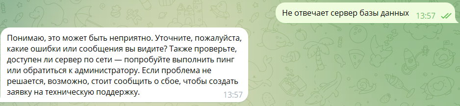

# my_first_bot — бот технической поддержки

Telegram-бот технической поддержки на базе LLM. Отвечает на вопросы пользователей в роли специалиста поддержки, а на сообщение-оповещение о сбое создаёт сервисную заявку и сообщает о ней в чат. Работает круглосуточно в облаке Railway.

## Демонстрация

Ответ в роли техподдержки: бот уточняет симптомы, предлагает шаги диагностики и советует сообщить о сбое, чтобы создать заявку.



## Возможности

- **Ответы техподдержки.** На любой текст бот отвечает как специалист поддержки: уточняет симптомы и предлагает шаги диагностики. Помнит последние 20 сообщений чата.
- **Заявки по оповещениям.** Сообщение, подходящее под правило оповещения (по умолчанию содержит `#alert`), превращается в сервисную заявку. Бот пишет в чат «Заявка №N создана: тема» и краткое описание. Тему и описание формулирует модель; если она недоступна, берётся текст оповещения.
- **Защита от дублей.** Одно и то же оповещение не создаёт вторую заявку.
- **Оповещения из каналов.** В канале, где бот — администратор, он обрабатывает посты-оповещения от любых авторов, включая других ботов.
- **Устойчивость к ошибкам.** Таймауты, лимиты и недоступность модели не роняют бота: пользователь получает короткое понятное сообщение. Нетекстовые и слишком длинные (более 2000 символов) сообщения вежливо отклоняются.
- **Задел на будущее.** Уведомление о закрытии заявки и подключение реальной системы заявок вместо встроенной заглушки.

## Технологический стек

| Слой | Технология |
|---|---|
| Язык | Python 3.12 |
| Зависимости | [uv](https://docs.astral.sh/uv/) (`pyproject.toml`, `uv.lock`) |
| Telegram | aiogram 3, long polling |
| LLM | пакет `openai` + [OpenRouter](https://openrouter.ai), модель по умолчанию `openai/gpt-4o-mini` |
| Конфигурация | переменные окружения, `python-dotenv` для локального `.env` |
| Запуск | Make, Docker |
| Хостинг | [Railway](https://railway.com) |

Архитектура и решения: [`docs/vision.md`](docs/vision.md), план разработки: [`docs/tasklist.md`](docs/tasklist.md).

## Установка и запуск

### 1. Подготовка

1. Создайте бота у [@BotFather](https://t.me/BotFather) и получите токен.
2. Получите ключ OpenRouter на [openrouter.ai/keys](https://openrouter.ai/keys).
3. Установите [uv](https://docs.astral.sh/uv/) и Make; для запуска в контейнере — Docker Desktop.
4. Склонируйте репозиторий:

   ```
   git clone https://github.com/Fourliy/my_first_bot.git
   cd my_first_bot
   ```

### 2. Настройка

Скопируйте `.env.example` в `.env` и заполните значения:

| Переменная | Обязательна | Описание |
|---|---|---|
| `TELEGRAM_TOKEN` | да | токен бота от BotFather |
| `OPENROUTER_API_KEY` | да | ключ OpenRouter |
| `MODEL_NAME` | нет | модель, по умолчанию `openai/gpt-4o-mini` |
| `LOG_LEVEL` | нет | уровень логов, по умолчанию `INFO` |
| `ALERT_PATTERN` | нет | ключевое слово или регулярное выражение оповещения, по умолчанию `#alert` |
| `ALERT_CHAT_ID` | нет | принимать оповещения только из этого чата или канала |
| `ALERT_SENDER_ID` | нет | принимать оповещения только от этого отправителя |
| `NOTIFY_CHAT_ID` | нет | куда отправлять уведомления о заявках; по умолчанию — чат оповещения |

Файл `.env` не попадает в git и в Docker-образ. Не публикуйте токен и ключ.

### 3. Локальный запуск

```
# в виртуальном окружении
make install
make run

# или в Docker
make docker-build
make docker-run
```

Остановка: `Ctrl+C`. Другие цели Make: `venv`, `clean`.

Одновременно должен работать только один экземпляр бота: два процесса с одним токеном конфликтуют (ошибка `Conflict: terminated by other getUpdates request`). Если бот запущен в Railway, локально его не запускайте.

### 4. Деплой в Railway

1. В [Railway](https://railway.com): New Project → Deploy from GitHub repo → этот репозиторий.
2. Railway соберёт образ по `Dockerfile`; настройки сборки и перезапуска при падении лежат в `railway.json`.
3. В сервисе откройте Variables → Raw Editor, вставьте переменные из таблицы выше, нажмите Update Variables, затем Deploy. Локальный `.env` в Railway не попадает.
4. Оставьте один экземпляр сервиса. Публичный домен не нужен: бот сам опрашивает Telegram.
5. Каждый push в `main` запускает новый деплой. Если автодеплой недоступен («Could not load branches»), выдайте приложению Railway доступ к репозиторию на [github.com/settings/installations](https://github.com/settings/installations).

После старта в логах (Deployments → View Logs) появляется строка `Bot started alerts_enabled=True`.

## Как пользоваться

1. Откройте бота по ссылке `https://t.me/<имя_бота>` и нажмите «Старт».
2. Задайте вопрос — например, «не открывается личный кабинет».
3. Сообщите о сбое: `#alert Не отвечает сервер базы данных` — бот создаст заявку и пришлёт её номер.

Оповещения от других ботов: в группах Telegram не доставляет боту сообщения других ботов. Публикуйте оповещения в канал и добавьте туда бота администратором. Чтобы `#alert` работал в обычной группе, отключите режим конфиденциальности в BotFather (`/setprivacy` → Disable) или сделайте бота администратором.

## Настройка поведения

- Роль и стиль ответов — `SYSTEM_PROMPT`, оформление заявки — `TICKET_PROMPT` в `src/my_first_bot/config.py`.
- Правило оповещения — переменные `ALERT_*`, логика — `src/my_first_bot/alert_handler.py`.
- Система заявок — интерфейс `TicketService` в `src/my_first_bot/ticket_service.py`. Сейчас подключена заглушка `StubTicketService`; для реальной системы нужен класс с тем же интерфейсом и замена в `runner.py`.
- Размер истории (`MAX_HISTORY`) и лимит ввода (`MAX_INPUT_CHARS`) — `src/my_first_bot/telegram_bot.py`; лимит длины ответа (`MAX_TOKENS`) — `src/my_first_bot/llm_client.py`.

## Ограничения

- Заявки создаются во встроенной заглушке и не попадают во внешнюю систему.
- Уведомление о закрытии заявки пока не запускается.
- История диалогов и заявки хранятся только в памяти и пропадают при перезапуске.
- Нет базы данных, автотестов и CI.
