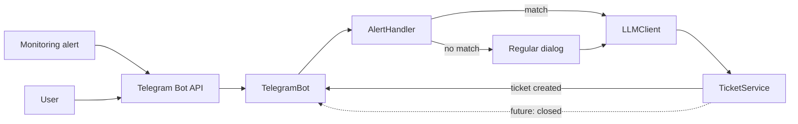

# Техническое видение

Документ — отправная точка для разработки Telegram LLM-ассистента технической поддержки из `docs/idea.md`. Цель: максимально простое решение, которое работает постоянно в облаке Railway.

## Технологии

| Слой | Выбор |
|---|---|
| Язык | Python 3.12 |
| Зависимости | uv (`pyproject.toml` + lock-файл) |
| Telegram | aiogram 3, long polling |
| LLM | пакет openai, API OpenRouter |
| Конфиг | переменные окружения |
| Логи | стандартный модуль `logging` |
| Запуск | Make (локально и через Docker) |
| Контейнер | Docker: локальный запуск и сборка образа для облака |
| Хостинг | Railway (Docker-образ из репозитория) |

Других библиотек нет: ни БД, ни Redis, ни веб-фреймворка, ни webhook.

Long polling выбран сознательно: боту не нужен публичный адрес, поэтому он одинаково запускается и на компьютере разработчика, и в Railway без дополнительной настройки сети.

## Принцип разработки

- Цель: минимальное рабочее решение — бот реагирует на оповещение, создаёт заявку и сообщает о ней; плюс обычный диалог.
- KISS: избегаем лишних слоёв и абстракций; добавляем только то, что напрямую нужно.
- OOP, один класс — один файл.
- Ясные границы ответственности:
	- `Config` — чтение и валидация окружения;
	- `LLMClient` — вызовы `openai`/OpenRouter, таймауты, обработка ошибок;
	- `TelegramBot` — обработка сообщений через `aiogram` (polling) и перевод в/из внутреннего формата;
	- `AlertHandler` — распознаёт сообщение-оповещение по правилу из конфига;
	- `TicketService` — создание и закрытие сервисных заявок (интерфейс); `StubTicketService` — заглушка до появления реальной системы;
	- `Runner` — сборка компонентов и запуск long-polling.
- Система заявок скрыта за `TicketService`: замена заглушки на адаптер к реальной системе не должна затрагивать `TelegramBot` и `AlertHandler`.
- Конфиг и секреты — только через переменные окружения; `.env` — только для локальной разработки (не коммитить), в облаке — Railway Variables.
- Нет персистентности: диалоги и заявки-заглушки хранятся в памяти; добавление БД — отдельный ADR при необходимости.
- Обработка ошибок: таймауты и понятные ответы пользователю при ошибках LLM; сбой LLM не должен мешать созданию заявки.
- Тестируемость: отделяем I/O от логики; `LLMClient`, `TicketService` и Telegram-интеграция легко мокируются.
- Минимум зависимостей: `aiogram`, `openai`, `python-dotenv`.

## Структура проекта

```
pyproject.toml
uv.lock
.env.example
Makefile
Dockerfile
railway.json          # опционально: настройки сборки и перезапуска в Railway
docs/
	idea.md
	vision.md
	tasklist.md
	adrs/
src/my_first_bot/
	__init__.py
	config.py          # Config: чтение переменных окружения, SYSTEM_PROMPT
	logger.py          # Настройка logging
	llm_client.py      # LLMClient: обёртка openai / OpenRouter
	telegram_bot.py    # TelegramBot: aiogram handlers (polling)
	alert_handler.py   # AlertHandler: распознавание сообщения-оповещения
	ticket_service.py  # TicketService (интерфейс) и StubTicketService (заглушка)
	runner.py          # Runner: собирает компоненты и запускает polling
	models.py          # Датаклассы: DialogMessage, Dialog, Ticket
tests/
```

## Архитектура

Приложение — однопроцессный асинхронный сервис (asyncio), использующий long-polling `aiogram` для приёма сообщений. Каждый модуль выполняет одну роль и легко тестируется.

Компоненты и взаимодействие:



### Сценарий 1: оповещение → заявка → уведомление

1. В чат приходит сообщение-оповещение (например, от системы мониторинга).
2. `TelegramBot` передаёт сообщение в `AlertHandler`.
3. `AlertHandler` проверяет правило из конфига: чат (`ALERT_CHAT_ID`), отправитель (`ALERT_SENDER_ID`), шаблон текста (`ALERT_PATTERN`). Если правило не совпало — сообщение идёт в обычный диалог (или игнорируется в служебном чате).
4. При совпадении логируется `event=alert_detected`, и `LLMClient` формулирует по тексту оповещения краткую тему и описание заявки. Если LLM недоступна — используется исходный текст оповещения.
5. `TicketService.create(...)` создаёт заявку и возвращает `Ticket` с номером; логируется `event=ticket_created`.
6. `TelegramBot` отправляет в чат (`NOTIFY_CHAT_ID` или исходный чат) уведомление: «Заявка №N создана: <тема>».
7. В будущем: `TicketService.close(ticket_id)` переводит заявку в статус `closed`, бот отправляет «Заявка №N закрыта» (`event=ticket_closed`). Источник события закрытия (сообщение в чате, опрос системы заявок, webhook) будет определён вместе с реальной системой заявок.

### Сценарий 2: обычный диалог

1. Сообщение от пользователя приходит в Telegram Bot API.
2. `aiogram Dispatcher` вызывает хэндлер в `TelegramBot`; `AlertHandler` не распознаёт оповещение.
3. `TelegramBot` добавляет сообщение в in-memory `Dialog` (chat_id -> история).
4. `TelegramBot` вызывает `LLMClient.chat(messages)` со списком system + history + user.
5. Ответ отправляется пользователю, история обновляется и обрезается по лимиту.

### Ограничение Telegram: сообщения от других ботов

В группах Telegram не доставляет боту сообщения, отправленные другими ботами. Поэтому если оповещения шлёт бот мониторинга, нужен один из вариантов:

- **Канал**, в котором наш бот — администратор: бот получает `channel_post` от любого автора, включая других ботов. Основной вариант.
- **Сообщение от человека** или пересылка оповещения человеком в чат с ботом.
- **Прямая интеграция**: источник оповещений пишет нашему боту не через чат, а напрямую (потребует webhook или API — отдельный ADR).

Конкретный вариант выбирается, когда будут известны реальный источник и формат оповещений. До этого проверка ведётся на канале или на сообщении от человека с ключевым словом.

### Надёжность и ограничения

- Таймауты для LLM-запросов (20–30 с) и вежливое сообщение пользователю при ошибке.
- Ретраи для временных ошибок с ограничением числа попыток.
- Ограничение истории по количеству сообщений (FIFO).
- Одно оповещение — одна заявка: повторная обработка одного и того же сообщения не должна создавать дубль (проверка по `message_id` в памяти).
- Логирование без секретов: события, ошибки и latency.

### Конкурентность и масштабирование

- Один процесс / один экземпляр сервиса; aiogram асинхронно обрабатывает несколько чатов.
- Два процесса с long polling на одном токене конфликтуют (ошибка Telegram 409 Conflict), поэтому одновременно работает только один экземпляр: либо локальный, либо в Railway.
- Горизонтальное масштабирование потребует внешнего хранилища и перехода на webhook — отдельный ADR.

### Безопасность

- Секреты только в окружении; не логировать ключи и полные тексты сообщений с чувствительным содержимым.

## Модель данных

Состояние хранится в памяти; используются простые датаклассы. Персистентность — только по отдельному ADR.

- `DialogMessage`:
	- `role: Literal['system','user','assistant']` — роль автора;
	- `content: str` — текст сообщения.
- `Dialog` — история одного чата: список `DialogMessage` и `asyncio.Lock` для последовательной обработки.
- `Ticket`:
	- `id: str` — номер заявки (в заглушке генерируется локально, в реальной системе — присваивается ею);
	- `status: Literal['open','closed']`;
	- `title: str` — краткая тема;
	- `description: str` — описание (по тексту оповещения);
	- `source_chat_id: int` — чат, откуда пришло оповещение;
	- `source_message_id: int` — сообщение-оповещение (для защиты от дублей);
	- `created_at: datetime`;
	- `closed_at: datetime | None`.

## Работа с LLM

- Формат OpenAI Chat: список `{"role": "system|user|assistant", "content": "..."}`.
- `SYSTEM_PROMPT` задаётся в `config.py`: роль специалиста технической поддержки — вежливо, кратко, по делу, без выдуманных фактов.
- Для заявки используется отдельный короткий промпт: по тексту оповещения вернуть тему (одна строка) и описание (2–4 предложения).
- Модель выбирается через `MODEL_NAME`.

## Конфигурация

| Переменная | Обязательна | Назначение |
|---|---|---|
| `TELEGRAM_TOKEN` | да | Токен бота |
| `OPENROUTER_API_KEY` | да | Ключ OpenRouter |
| `MODEL_NAME` | нет | Модель, по умолчанию `openai/gpt-4o-mini` |
| `LOG_LEVEL` | нет | Уровень логов, по умолчанию `INFO` |
| `ALERT_CHAT_ID` | нет | Чат/канал, где ждём оповещения |
| `ALERT_SENDER_ID` | нет | Отправитель оповещений |
| `ALERT_PATTERN` | нет | Ключевое слово или регулярное выражение для распознавания оповещения |
| `NOTIFY_CHAT_ID` | нет | Куда отправлять уведомления о заявках; по умолчанию — исходный чат |

Если правило оповещения не задано (`ALERT_*` пусты), бот работает только в режиме диалога. Все переменные перечислены в `.env.example`.

## Логирование

- Модуль `logger.py` настраивает логгер `my_first_bot`, вывод — в stdout (локально в консоль, в Railway — в логи деплоя).
- Уровень — через `LOG_LEVEL`.
- События: `start`, `message`, `dialog`, `llm_error`, `alert_detected`, `ticket_created`, `ticket_closed`.
- Поля: `event`, `chat_id`, `message_len`, `ticket_id`, `latency_ms`, `status`.
- `ERROR` — с `exc_info=True`, без секретов.

## Сборка и деплой

Цель: простой локальный цикл разработки и постоянная работа бота в облаке Railway.

### Локально

- venv + `uv` + `make`:
	```powershell
	make install
	make run
	```
- Docker (prod-like проверка перед деплоем):
	```powershell
	make docker-build
	make docker-run
	```

Make targets: `venv`, `install`, `run`, `docker-build`, `docker-run`, `clean`.

### Railway

- Сервис создаётся из GitHub-репозитория; Railway собирает образ по `Dockerfile` из корня и запускает команду `CMD` из него.
- Бот работает как фоновый worker в режиме long polling: публичный домен, порт и webhook не нужны.
- Секреты и настройки (`TELEGRAM_TOKEN`, `OPENROUTER_API_KEY`, `MODEL_NAME`, `LOG_LEVEL`, `ALERT_*`, `NOTIFY_CHAT_ID`) задаются в Railway Variables; `.env` в образ не попадает (`.dockerignore`).
- Количество экземпляров — ровно один. На время работы в Railway локальный бот с тем же токеном должен быть остановлен.
- Политика перезапуска — On Failure, чтобы бот поднимался после падения.
- Деплой — автоматически при push в основную ветку или вручную из панели Railway.
- Логи доступны в разделе Deployments → Logs.
- Состояние в памяти (диалоги, заявки-заглушки) теряется при каждом редеплое и перезапуске. До подключения реальной системы заявок это допустимо.
- Опционально — `railway.json` в репозитории, чтобы настройки сборки и перезапуска хранились в коде:
	```json
	{
	  "$schema": "https://railway.com/railway.schema.json",
	  "build": { "builder": "DOCKERFILE", "dockerfilePath": "Dockerfile" },
	  "deploy": { "numReplicas": 1, "restartPolicyType": "ON_FAILURE", "restartPolicyMaxRetries": 10 }
	}
	```

### Рекомендации

- `.env.example` — перечень всех переменных; реальные секреты — только в `.env` локально и в Railway Variables.
- В `Dockerfile` не добавлять секреты.
- Перед деплоем проверять образ локально через `make docker-build` и `make docker-run`.
